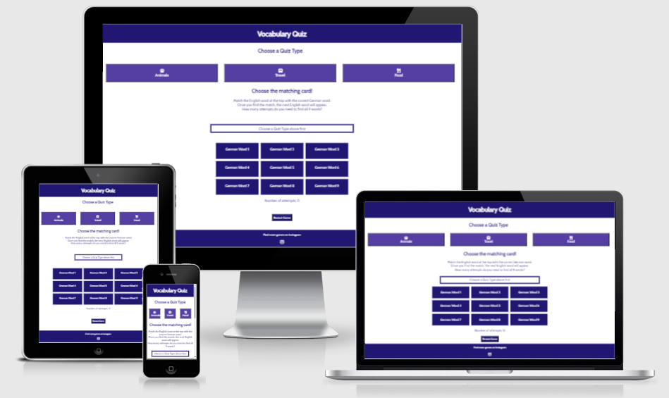
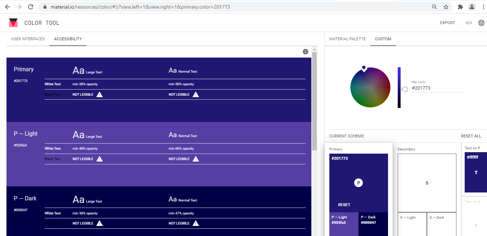
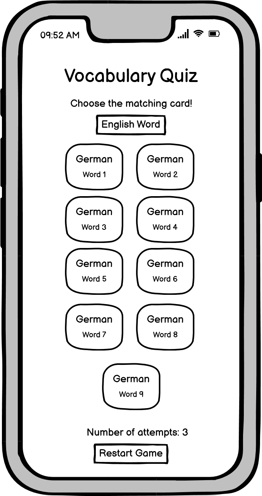
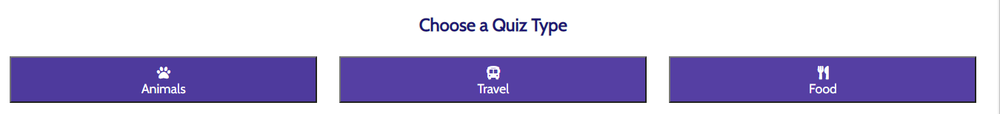
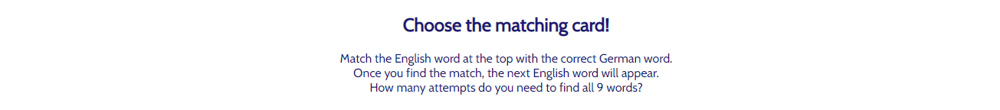
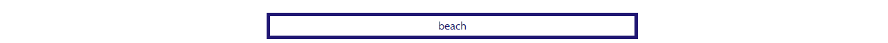
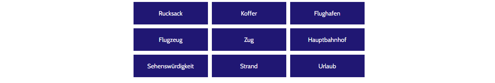
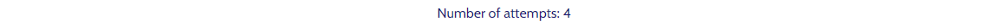
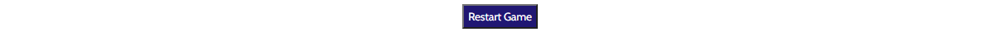

# Vocabulary Quiz

Vocabulary Quiz is a language game that will allow the user to test their skills in English and German. The user can choose a topic by selecting a quiz type. The quiz is set up so that the user will find matching word pairs. Motivation is kept up by counting the number of attempts the user needs to find all word pairs. The user can try to find all words with the lowest possible amount of attempts.

## User Stories

- As a user I want to be able to see the purpose of the website.
- As a user I want to be able to choose a quiz type so that I can test my knowledge for a specific vocabulary topic.
- As a user I want to see instructions for the quiz so that I know how to play it.
- As a user I want to be able to click a German language card matching to the given English word so that I can test my knowledge. 
- As a user I want to see how many attempts I have needed to complete the quiz so that I can try to improve.
- As a user I want to be able to restart the game so that I don't have to finish it completely before starting again.
- As a user I want to see social media icons so that I can visit social media websites with one click. 

## UX
### Colour Scheme

[Color Tool](https://material.io/resources/color/#!/?view.left=1&view.right=1&primary.color=201773) and [Adobe Color](https://color.adobe.com/create/color-contrast-analyzer) have been used to find and test the colors. #201773 is used as the main color and as the background color for header and footer. The lighter color #553fa3 is used for the quiz type buttons. #201773 is used again when hovering over the quiz type buttons. #000047 is used when hovering over the german words buttons. To make sure these three colors contrast well with the color #fff, which is used a background and font color respectively, all colors were tested in a contrast checker.

### Typography 

Google Fonts has been used to find the font, that is displayed on the website. [Cabin](https://fonts.google.com/specimen/Cabin?category=Sans+Serif&preview.text=Vocabulary%20Quiz&preview.text_type=custom#standard-styles) is described as having a touch of modernism as well as having a wide language support including all Western, Central and South/Eastern European languages, which was found suitable for a vocabulary language quiz.

To provide visual cues icons from [Font Awesome](https://fontawesome.com/) have been used in the quiz type buttons and for the icon that links to Instagram.

### Wireframes

Wireframes created with Balsamiq were used to plan the layout of the website.

## Features 

### Existing Features

- __Header__

  - The main heading in the header will allow the user to see the purpose of the website.

- __Quiz Type Buttons__

  - Three quiz type buttons will allow the user to choose between three different quiz types depending on the topic they would like to test their vocabulary knowledge in. The buttons have appropriate icons to give a visual cue as well.

- __Quiz Explanation__

  - The quiz explanation will guide the user on how to use the Vocabulary Quiz and point out the aim of the quiz.

- __English Word__

  - In the English Word box the user will see the English word for which they have to find the matching German card.

- __German Words__

  - This section will display nine buttons with nine different German words that the user can click.
  - If the word is matching the English word, the box will appear in green and a new English word will appear.
  - If the word is incorrect the box will appear in red and the user can try again.

- __Number of Attempts__ 

  - In this section the user can see the overall number of attempts they have made so far.

- __Restart Game__

  - This button will allow the user to restart the game and reload the page.

- __Footer__

  - The footer will display a link to social media.
  - The user can click the icon to visit the social media website in a separate tab.

### Features Left to Implement

- __Quizes for Different Languages__

  - A feature that allows the user to choose a different language, for which they would like to take the quiz.

- __Different Quiz Categories__

  - Incorporate different quiz categories like months, days of the week and colors.

## Technologies Used

- HTML was used to structure the website semantically and display it in the browser.
- CSS was used for the presentation and style of the website.
- CSS grid was used for the layout of the website.
- JavaScript was used to make the website interactive.
- [Balsamiq](https://balsamiq.com/wireframes/) was used to create the wireframes.
- [Gitpod](https://www.gitpod.io/) was used for the development of the website.
- [Github](https://github.com/) was used to store the code online.
- Git was used for version control.
- [hatchful](https://hatchful.shopify.com/) was used for the favicon.
- [Font Awesome](https://fontawesome.com/) was used for the icons.

## Testing

Due to the length of testing, you can see all tests in the [TESTING.md](TESTING.md) file.

## Deployment

- The site was deployed to GitHub pages. The steps to deploy are as follows: 
  - In the GitHub repository, navigate to the Settings tab 
  - From the source section drop-down menu, select the Main Branch
  - Once the main branch has been selected, the page will be automatically refreshed with a detailed ribbon display to indicate the successful deployment. 

The live link can be found here - https://julianegampe.github.io/vocabulary-quiz/ 

### Local Deployment

If you would like to make a local copy of this repository, you can clone it by typing the following command in your IDE terminal:
- `git clone https://github.com/JulianeGampe/vocabulary-quiz.git`

Alternatively, if using Gitpod, you can click below to create your own workspace using this repository.

## Credits 

### Content

- Code for the Modal has been taken from [w3schools](https://www.w3schools.com/howto/howto_css_modals.asp)

### Media 

- The following websites were used to find the colors and do the contrast tests:
  - [Color Tool](https://material.io/resources/color/#!/?view.left=1&view.right=1&primary.color=201773)
  - [Adobe Color](https://color.adobe.com/create/color-contrast-analyzer)
- The font was found on [Google Fonts](https://fonts.google.com/)
  - [Cabin](https://fonts.google.com/specimen/Cabin?category=Sans+Serif&preview.text=Vocabulary%20Quiz&preview.text_type=custom#standard-styles)
- The icons in the quiz type buttons and footer were taken from [Font Awesome](https://fontawesome.com/)
  - [Animals Icon](https://fontawesome.com/v5.15/icons/paw?style=solid)
  - [Travel Icon](https://fontawesome.com/v5.15/icons/bus-alt?style=solid)
  - [Food Icon](https://fontawesome.com/v5.15/icons/utensils?style=solid)
  - [Instagram Icon](https://fontawesome.com/v5.15/icons/instagram?style=brands)
- [Balsamiq](https://balsamiq.com/wireframes/) was used to create the wireframes.
- [hatchful](https://hatchful.shopify.com/) was used for the favicon. 
- [Am I responsive](http://ami.responsivedesign.is/) has been used to create the responsive mockup of the project

### Acknowledgements

- I would like to thank my mentor Tim Nelson for his support, guidance and encouragement.
