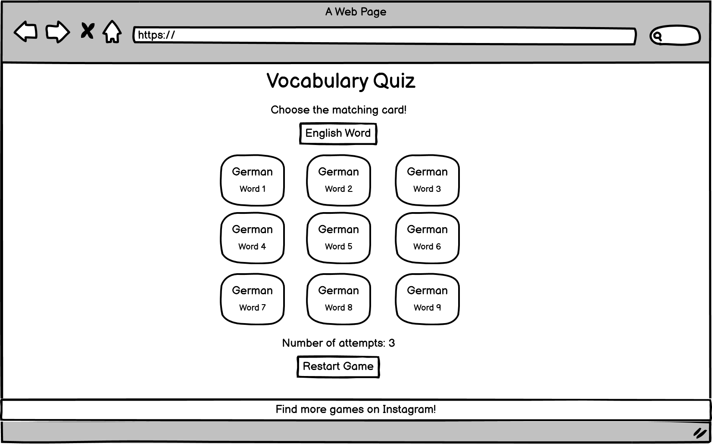
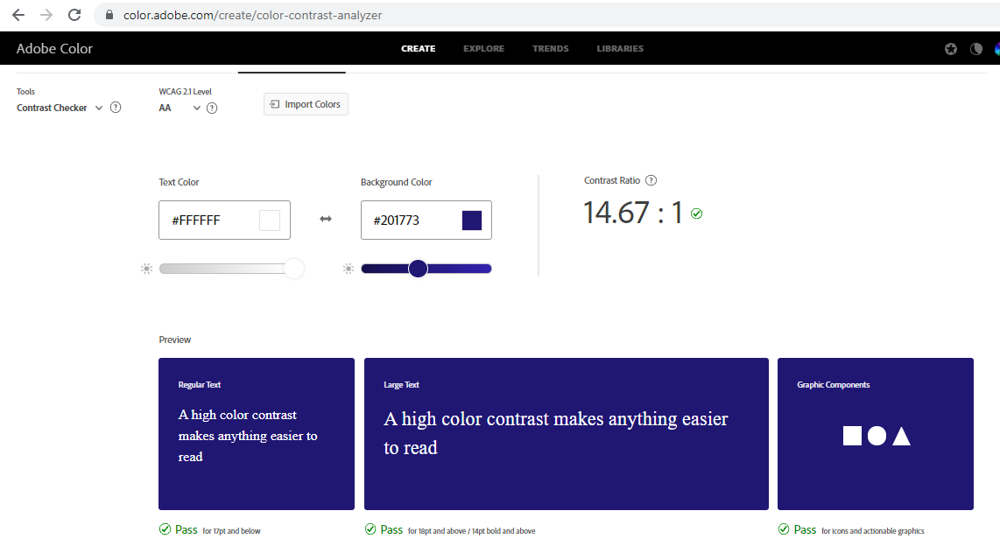

# Vocabulary Quiz

Vocabulary Quiz is a language game that will allow the user to test their skills in English and German. The user can choose a topic by selecting a quiz type. The quiz is set up so that the user will find matching word pairs. Motivation is kept up by counting the number of attempts the user needs to find all word pairs. The user can try to find all words with the lowest possible amount of attempts.

## User Stories

- As a user I want to be able to see the purpose of the website.
- As a user I want to be able to choose a quiz type so that I can test my knowledge for a specific vocabulary topic.
- As a user I want to see instructions for the quiz so that I know how to play it.
- As a user I want to be able to click a German language card matching to the given English word so that I can test my knowledge. 
- As a user I want to see how many attempts I have needed to complete the quiz so that I can try to improve.
- As a user I want to be able to restart the game so that I don't have to finish it completely before starting again.
- As a user I want to see social media icons so that I can visit social media websites with one click. 

## UX
### Colour Scheme

[Color Tool](https://material.io/resources/color/#!/?view.left=1&view.right=1&primary.color=201773) and [Adobe Color](https://color.adobe.com/create/color-contrast-analyzer) have been used to find and test the colors. #201773 is used as the main color and as the background color for header and footer. The lighter color #553fa3 is used for the quiz type buttons. #201773 is used again when hovering over the quiz type buttons. #000047 is used when hovering over the german words buttons. To make sure these three colors contrast well with the color #fff, which is used a background and font color respectively, all colors were tested in a contrast checker.

### Typography 

Google Fonts has been used to find the font, that is displayed on the website. [Cabin](https://fonts.google.com/specimen/Cabin?category=Sans+Serif&preview.text=Vocabulary%20Quiz&preview.text_type=custom#standard-styles) is described as having a touch of modernism as well as having a wide language support including all Western, Central and South/Eastern European languages, which was found suitable for a vocabulary language quiz.

To provide visual cues icons from [Font Awesome](https://fontawesome.com/) have been used in the quiz type buttons and for the icon that links to Instagram.

### Wireframes

Wireframes created with Balsamiq were used to plan the layout of the website.

## Features 

### Existing Features

- __Header__

  - The main heading in the header will allow the user to see the purpose of the website.

- __Quiz explanation__

  - The quiz explantion will guide the user on how to use the Vocabulary Quiz and point out the aim of the quiz.

- __English Word__

  - In the English Word box the user will see the English word for which they have to find the matching German card.

- __German Words__

  - This section will display nine buttons with nine different German words that the user can click.
  - If the word is matching the English word, a new English word will appear.
  - If the word is incorrect the user can try again.

- __Number of Attempts__ 

  - In this section the user can see the overall number of attempts he has made so far.

- __Restart Game__

  - This button will allow the user to restart the game and set the number of attempts to zero. 

- __Footer__

  - The footer will display a link to social media.
  - The user can click the icon to visit the social media website in a separate tab.

### Features Left to Implement

__Quizes for different topics__

- A feature that allows the user to choose a specific topic for which they want to practice new words.

__Quizes for different languages__

 - A feature that allow the user to choose a different language that they want to take the quiz for.

## Technologies Used

- HTML was used to structure the website semantically and display it in the browser.
- CSS was used for the presentation and style of the website.
- CSS grid was used for the layout of the website.
- JavaScript was used to make the website interactive.
- [Balsamiq](https://balsamiq.com/wireframes/) was used to create the wireframes.
- [Gitpod](https://www.gitpod.io/) was used for the development of the website.
- [Github](https://github.com/) was used to store the code online.
- Git was used for version control.
- [hatchful](https://hatchful.shopify.com/) was used for the favicon.
- [Font Awesome](https://fontawesome.com/) was used for the icons.

## Testing 

- All colors have been tested with a contrast checker.

  - Contrast test #201773 against #ffffff
  

  - Contrast test #553fa3 against #ffffff
  

  - Contrast test #000047 against #ffffff
  

  - Color accessibility #20173, #553fa3, #000047
  

In this section, you need to convince the assessor that you have conducted enough testing to legitimately believe that the site works well. Essentially, in this part you will want to go over all of your project’s features and ensure that they all work as intended, with the project providing an easy and straightforward way for the users to achieve their goals.

In addition, you should mention in this section how your project looks and works on different browsers and screen sizes.

You should also mention in this section any interesting bugs or problems you discovered during your testing, even if you haven't addressed them yet.

If this section grows too long, you may want to split it off into a separate file and link to it from here.

### Validator Testing 

- HTML
  - No errors were returned when passing through the official [W3C validator](https://validator.w3.org/nu/?doc=https%3A%2F%2Fcode-institute-org.github.io%2Flove-running-2.0%2Findex.html)
- CSS
  - No errors were found when passing through the official [(Jigsaw) validator](https://jigsaw.w3.org/css-validator/validator?uri=https%3A%2F%2Fvalidator.w3.org%2Fnu%2F%3Fdoc%3Dhttps%253A%252F%252Fcode-institute-org.github.io%252Flove-running-2.0%252Findex.html&profile=css3svg&usermedium=all&warning=1&vextwarning=&lang=en#css)

### Browser Compatibility
### Responsiveness
### Testing User Stories

- As a user I want to be able to see the purpose of the website.

- As a user I want to be able to choose a quiz type so that I can test my knowledge for a specific vocabulary topic.

- As a user I want to see instructions for the quiz so that I know how to play it.

- As a user I want to be able to click a German language card matching to the given English word so that I can test my knowledge. 

- As a user I want to see how many attempts I have needed to complete the quiz so that I can try to improve.

- As a user I want to be able to restart the game so that I don't have to finish it completely before starting again.

- As a user I want to see social media icons so that I can visit social media websites with one click.

### Unfixed Bugs

You will need to mention unfixed bugs and why they were not fixed. This section should include shortcomings of the frameworks or technologies used. Although time can be a big variable to consider, paucity of time and difficulty understanding implementation is not a valid reason to leave bugs unfixed. 

## Deployment

This section should describe the process you went through to deploy the project to a hosting platform (e.g. GitHub) 

- The site was deployed to GitHub pages. The steps to deploy are as follows: 
  - In the GitHub repository, navigate to the Settings tab 
  - From the source section drop-down menu, select the Main Branch
  - Once the main branch has been selected, the page will be automatically refreshed with a detailed ribbon display to indicate the successful deployment. 

The live link can be found here - https://julianegampe.github.io/vocabulary-quiz/ 

### Local Deployment

If you would like to make a local copy of this repository, you can clone it by typing the following command in your IDE terminal:
- `https://github.com/JulianeGampe/vocabulary-quiz.git`

Alternatively, if you use Gitpod, you can [click here](https://gitpod.io/#https://github.com/JulianeGampe/vocabulary-quiz) to generate a new workspace using this repository.

## Credits 

In this section you need to reference where you got your content, media and extra help from. It is common practice to use code from other repositories and tutorials, however, it is important to be very specific about these sources to avoid plagiarism. 

You can break the credits section up into Content and Media, depending on what you have included in your project. 

### Content 

- The following websites were used to find the colors and do the contrast tests:
  - [Color Tool](https://material.io/resources/color/#!/?view.left=1&view.right=1&primary.color=201773)
  - [Adobe Color](https://color.adobe.com/create/color-contrast-analyzer)
- The font was found on [Google Fonts](https://fonts.google.com/)
  - [Cabin](https://fonts.google.com/specimen/Cabin?category=Sans+Serif&preview.text=Vocabulary%20Quiz&preview.text_type=custom#standard-styles)
- The icons in the quiz type buttons and footer were taken from [Font Awesome](https://fontawesome.com/)
  - [Animals Icon](https://fontawesome.com/v5.15/icons/paw?style=solid)
  - [Travel Icon](https://fontawesome.com/v5.15/icons/bus-alt?style=solid)
  - [Food Icon](https://fontawesome.com/v5.15/icons/utensils?style=solid)
  - [Instagram Icon](https://fontawesome.com/v5.15/icons/instagram?style=brands)
- [Balsamiq](https://balsamiq.com/wireframes/) was used to create the wireframes.
- [hatchful](https://hatchful.shopify.com/) was used for the favicon. 
- Code for the Modal has been taken from [w3schools](https://www.w3schools.com/howto/howto_css_modals.asp)

### Media

- The photos used on the home and sign up page are from This Open Source site
- The images used for the gallery page were taken from this other open source site

Congratulations on completing your Readme, you have made another big stride in the direction of being a developer! 

## Other General Project Advice

Below you will find a couple of extra tips that may be helpful when completing your project. Remember that each of these projects will become part of your final portfolio so it’s important to allow enough time to showcase your best work! 

- One of the most basic elements of keeping a healthy commit history is with the commit message. When getting started with your project, read through [this article](https://chris.beams.io/posts/git-commit/) by Chris Beams on How to Write  a Git Commit Message 
  - Make sure to keep the messages in the imperative mood 

- When naming the files in your project directory, make sure to consider meaningful naming of files, point to specific names and sections of content.
  - For example, instead of naming an image used ‘image1.png’ consider naming it ‘landing_page_img.png’. This will ensure that there are clear file paths kept. 

- Do some extra research on good and bad coding practices, there are a handful of useful articles to read, consider reviewing the following list when getting started:
  - [Writing Your Best Code](https://learn.shayhowe.com/html-css/writing-your-best-code/)
  - [HTML & CSS Coding Best Practices](https://medium.com/@inceptiondj.info/html-css-coding-best-practice-fadb9870a00f)
  - [Google HTML/CSS Style Guide](https://google.github.io/styleguide/htmlcssguide.html#General)

Getting started with your Portfolio Projects can be daunting, planning your project can make it a lot easier to tackle, take small steps to reach the final outcome and enjoy the process! 
