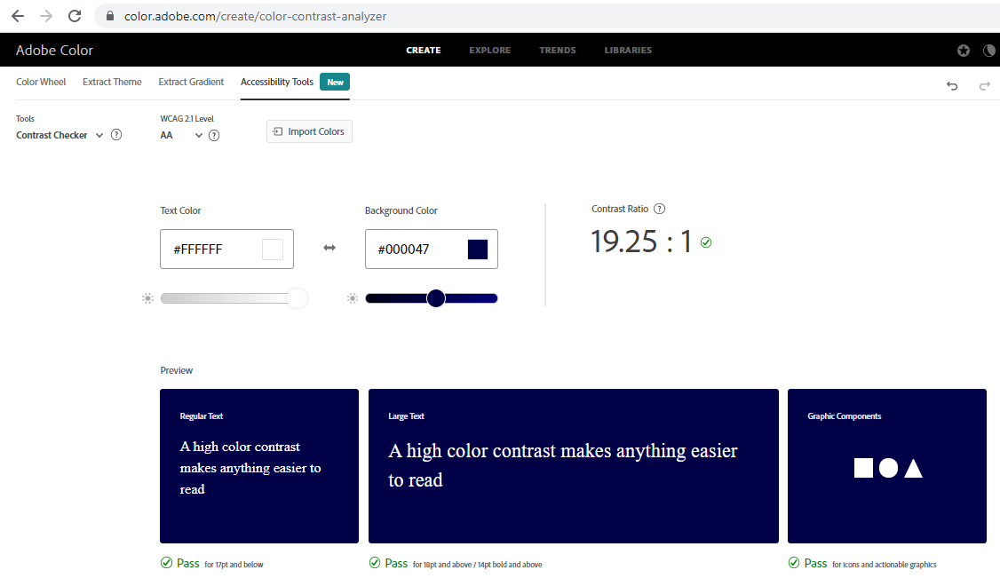

## Testing 

### Testing Color Contrasts

- All colors have been tested with a contrast checker.

  - Contrast test #201773 against #ffffff
  

  - Contrast test #553fa3 against #ffffff
  

  - Contrast test #000047 against #ffffff
  

  - Color accessibility #20173, #553fa3, #000047
  

### Validator Testing 

- HTML
  - No errors were returned when passing through the official [W3C validator](https://validator.w3.org/nu/?doc=https%3A%2F%2Fjulianegampe.github.io%2Fvocabulary-quiz%2F)
    

- CSS
  - No errors were found when passing through the official [(Jigsaw) validator](https://jigsaw.w3.org/css-validator/validator?uri=https%3A%2F%2Fjulianegampe.github.io%2Fvocabulary-quiz%2F&profile=css3svg&usermedium=all&warning=1&vextwarning=&lang=en)
    

- JavaScript
  - No errors were found when passing through [JSHint](https://jshint.com/)
    - script.js
    
    - words.js
    

### Browser Compatibility

- The page has been tested and works in different browsers.

  - Google Chrome
  
  

  - Firefox
  
  

  - Microsoft Edge
  
  

### Responsiveness

- The project is responsive and functions on all standard screen sizes using the devtools device bar.
- All features are readable and easy to understand.
- The game is fully functional and working. The quiz type buttons are working and a quiz type can be choosen. The German words cards are working and compared with the English word when clicked. The number of attempts are counted correctly. The restart game button is working. A modal is displaying when the game is finished.

    - Google Chrome Desktop

      

    - Google Chrome Mobile

      

    - Firefox Desktop

      

    - Firefox Tablet

      

    - Microsoft Edge Desktop

      

    - Microsoft Edge Mobile

      

### Testing User Stories

- As a user I want to be able to see the purpose of the website.

- As a user I want to be able to choose a quiz type so that I can test my knowledge for a specific vocabulary topic.

- As a user I want to see instructions for the quiz so that I know how to play it.

- As a user I want to be able to click a German language card matching to the given English word so that I can test my knowledge. 

- As a user I want to see how many attempts I have needed to complete the quiz so that I can try to improve.

- As a user I want to be able to restart the game so that I don't have to finish it completely before starting again.

- As a user I want to see social media icons so that I can visit social media websites with one click.

### Fixed Bugs

- When choosing a quiz type and then clicking on a different quiz type the number of attempts would     increment by two. When clicking on yet another quiz type it would increment by three and so forth. The reason for this was, that the calculateAttempts function, that increments the counter by one, was called for each German word box click event inside of each quiz button selection. If one quiz type was clicked it would increment and it would continue to increment even when another quiz type was clicked. This bug was solved by moving the click event listener for the German word boxes outside of the quizbutton selection and put on its own. 

### Known Bugs/Warnings

---

Return to the [README](README.md) file
